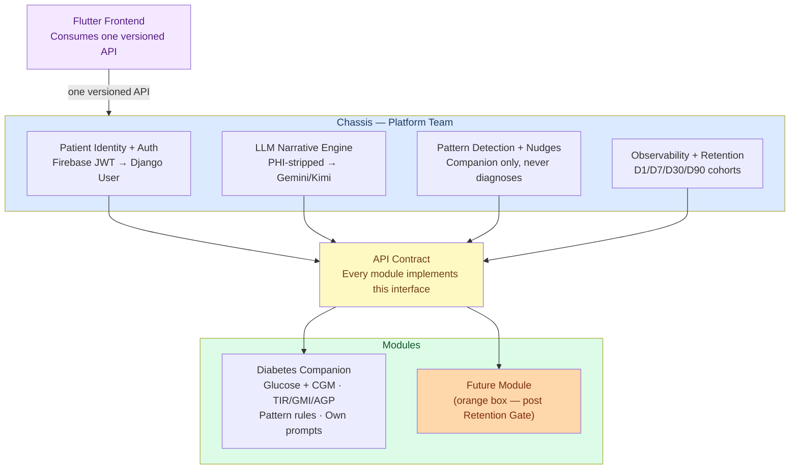

# Architecture — Health Companion Platform (Chassis + Modules)

> **Status:** CURRENT — this is the as-built architecture. The chassis was built and merged
> (platform program P0–P6 + P8.1; all 14 expert-review conditions resolved — see below).
> **Decision of record:** `docs/adr/ADR-0008-platform-chassis.md` (2026-06-04 founder reversal of DA-03).
> **Phase tracking:** `docs/ROADMAP.md` (Phases 18–26) is the single forward tracker. This doc
> describes the *design*; ROADMAP tracks the *work* — don't duplicate phase status here.
> **How we got here:** `ARCHITECTURE-TIMELINE.md` (v1 → v2 → v3.0 → DA-03 → ADR-0008).

---

## TL;DR

A **platform chassis + module contracts** model. The chassis provides shared services (auth, LLM narrative engine, pattern detection, observability) to pluggable condition modules. Each module owns its clinical data and domain logic; the chassis owns patient identity. Flutter consumes one versioned API surface across all modules. Diabetes is the one live module today; a second module (hypertension) is gated behind the Retention Gate (see ROADMAP Phase 25).

---

## What This Replaced (DA-03 → chassis)

> Historical context only — full reversal narrative in `ARCHITECTURE-TIMELINE.md`. DA-03 (v3.1)
> shipped a modular monolith with cheap seams and explicitly deferred platform machinery; ADR-0008
> reversed that and built the chassis below, as a scoped detour gated so nothing past P6 ships
> before the Retention Gate.

| DA-03 v3.1 (before) | Chassis (as built) |
|---|---|
| One Django monolith, one condition | Platform chassis + pluggable modules (`core/registry.py`) |
| Extension seams (ABC) — no real dispatch | Formal contract every module implements (`core/contracts/`) |
| Auth managed inside diabetes capsule | Auth in chassis (`core/api/v1/auth.py`); modules receive an authenticated patient |
| LLM pipeline in llm/ | Module-agnostic narrative gateway (`core/llm_gateway.py narrate()`) |
| Pattern detection inside diabetes/ | Detector seam in module; chassis-wide `DetectorRegistry` deferred → Phase 25 |
| Observability in core/ | Observability + retention in chassis (`core/observability/`) |
| No platform API | Static per-module router mount (`ModuleManifest.url_prefix`) |

---

## Architecture Layers

### Layer 1 — The Chassis (Platform Team Owned)

The chassis provides four services, available to all modules via API contract:

#### 1.1 Patient Identity + Auth
- Single login across all modules
- Modules receive an **authenticated patient object** — they never manage auth themselves
- Firebase Auth JWT → Django User bridge lives here
- `PatientProfile` base identity lives here (name, language, consent, biometrics baseline)

#### 1.2 LLM Narrative Engine
- Turns module-supplied data into plain-language insights
- **PHI stripped before reaching the model** (pseudonymizer as middleware — S2 already built)
- Module-agnostic: receives structured data + domain context, returns narrative text
- No module-specific prompt logic lives here — modules supply their own context

#### 1.3 Pattern Detection + Nudges
- Spots trends across module data
- Nudges the user toward healthy behavior
- **Never diagnoses or prescribes** — companion role only
- Plugs into observability events to detect behavioral patterns

#### 1.4 Observability + Retention
- Logs all module events (LOG_CREATED, SESSION_START, CHAT_MESSAGE, etc.)
- Tracks D1, D7, D30, D90 cohort retention
- Retention dashboard (staff-only)
- **Already built** as `core/observability/` (S4 + S5) — chassis-ready

**Data ownership rule:** Patient identity lives in the chassis. Clinical data (glucose readings, BP logs, etc.) lives inside each module.

---

### Layer 2 — API Contract

> *Every module implements this interface to plug into the chassis.*

The API contract defines what a module must expose for the chassis to:
- Deliver an LLM narrative (module provides structured data + domain context)
- Apply pattern detection (module provides event stream)
- Route observability events (module fires typed events)
- Serve the frontend (module exposes versioned endpoints)

**Contract surface (to be specified):**
- `ModuleManifest` — module name, version, condition, supported languages
- `analyze(patient, entries, kpis) → DomainContext` — module-provided clinical summary
- `event_schema` — typed event list the module can emit
- `router` — Django Ninja router mounted by chassis at `/api/v1/{module}/`

---

### Layer 3 — Modules

#### First-party: Diabetes Companion
- **Owns:** Glucose readings + CGM data, LogEntry model
- **Owns:** TIR · GMI · AGP · CV analytics (SQL-first, ADR-0007)
- **Owns:** Glucose pattern rules (10 detectors — DiabetesEngine)
- **Owns:** LLM context + prompts (domain-specific system prompt, Darija/FR)
- **Receives from chassis:** Authenticated patient, LLM narrative response, nudge triggers
- **Emits to chassis:** LOG_CREATED, SESSION_START, STREAK_*, CHAT_MESSAGE, SUMMARY_VIEWED

#### Future module (orange box placeholder)
- Hypertension companion, weight management, etc.
- Implements the same API contract
- Gets chassis services for free (auth, LLM, observability, pattern detection)
- Not built until Retention Gate passes — placeholder only

---

### Layer 4 — Flutter Frontend

- Consumes **one versioned API** surface across all modules
- No module-specific API client — chassis routes to the right module
- `API_BASE_URL` via `String.fromEnvironment`
- Offline-first via Drift local store → batch sync via SyncService
- GoRouter handles condition-specific deep links

---

## Current vs Target File Layout

### What already maps to chassis (reuse without moving)
| Current location | Chassis role |
|---|---|
| `core/observability/` | Observability + retention ✅ (S4+S5 complete) |
| `llm/pipeline.py` + `llm/middleware/` | LLM narrative engine middleware ✅ (S2 complete) |
| `core/engine/base.py` (BaseEngine ABC) | API contract seam ✅ (S1 complete) |
| `core/api/v1/auth.py` | Patient identity + auth ✅ |
| `core/api/v1/account.py` | RGPD / consent ✅ |
| `core/api/v1/health.py` | Chassis liveness probe ✅ |

### Chassis components (as built)
| Component | Location | Status |
|---|---|---|
| `ModuleManifest` + contract types | `core/contracts/` | ✅ Built (Phase 18/P0) |
| Module registry + static router mount | `core/registry.py`, `diabetes/api/main.py` | ✅ Built (Phase 21/P3) |
| Module-agnostic LLM gateway `narrate()` | `core/llm_gateway.py` | ✅ Built (Phase 19/P1.4) |
| `BasePatientProfile` + `PatientModule` | `core/models/patient.py`, `core/models/patient_module.py` | ✅ Built (Phase 20/P2) |
| Append-only triage registry + middleware | `core/safety_registry.py`, `core/middleware/triage_vital.py` | ✅ Built (Phase 19/P1.1) |
| RGPD account-delete hooks + `ErasureRecord` | `core/account_hooks.py`, `core/models/erasure_record.py` | ✅ Built (Phase 19/P1.2) |
| Chassis-wide pattern-detection service | `core/patterns/` | ⏸ Deferred → Phase 25 (no single-module value; `DetectorRegistry` wired with the 2nd module) |

### What stays in modules
| Component | Module |
|---|---|
| `LogEntry`, `PatientProfile` (diabetes-specific fields) | `diabetes/` |
| 10 clinical detectors + `DiabetesEngine` | `diabetes/services/clinical/` |
| SQL KPIs (TIR, GMI, AGP, CV, GRI) | `diabetes/services/clinical/sql_analytics.py` |
| Darija/FR prompt templates | `companion/templates/` |
| Glucose-specific API routes (logs, kpis, imports) | `diabetes/api/v1/` |

---

## Migration Path

The full build sequence (S1–S5 seams + the P0–P8 platform program) and its current status live in
`docs/ROADMAP.md` as **Phases 18–26**, with the detailed implementation record in
`platform-transformation-plan.md` (archived). Summary: P0–P6 + P8.1 are **built and merged**;
Phase 25 (P7 second module) and Phase 26 (P8.2–8.4 third-party infra) are **gated behind the
Retention Gate**. This doc is not the place to track phase status — ROADMAP is.

---

## Key Invariants (Never Bypass)

These carry over from DA-03 and remain non-negotiable:

| Invariant | Why |
|---|---|
| `TriageVitalMiddleware` first in chain | Medical emergency gate — bypass = patient risk |
| `UnitGuardMiddleware` second in chain | Glucose unit normalization — upstream of all AI |
| PHI stripped before LLM | Patient data never reaches model |
| SQL-first KPIs (ADR-0007) | No Python-computed KPIs |
| `client_uuid` on LogEntry | Offline sync idempotency |
| No diagnosis / no prescription | Companion role only |

---

## Expert Review Results (2026-06-04)

**Verdict unanime : APPROVE_WITH_CONDITIONS** — Software Architect · Backend Architect · Security Engineer · Product Manager

### 🔴 CRITIQUES — Bloqueantes avant tout code P1

**C1 — PHI bypass via accès LLM direct (Security — CRITICAL)**
`chassis.narrate()` doit être le seul point d'entrée LLM. Les modules ne peuvent pas importer depuis `llm/` ni appeler `get_llm()` directement. Enforcement : analyse statique + gate CI (Bandit).
✅ RESOLVED P1.3+P1.4: PHIStrippingMiddleware + chassis.narrate() sole entry point (`core/llm_gateway.py`)

**C2 — TriageVitalMiddleware aveugle sur nouvelles routes (Security — CRITICAL / patient safety)**
`_TRIAGE_PATHS` est hardcodé sur `/api/v1/ai/chat`. Tout nouveau module route interactive non déclarée reçoit une réponse LLM en urgence médicale. Déplacer dans `core/middleware/` avant P3. Les modules déclarent leurs endpoints interactifs dans `ModuleManifest.interactive_endpoints`.
✅ RESOLVED P1.1: AppendOnlyTriageRegistry, modules declare interactive_endpoints in ModuleManifest (`core/safety_registry.py`, `core/middleware/triage_vital.py`)
✅ EXTENDED P3: Both `/api/v1/ai/chat` (old Flutter) and `/api/v1/diabetes/ai/chat` (new namespaced) registered in TRIAGE_REGISTRY. (2026-06-05)

**C3 — Objet `patient` sur-privilégié (Security — HIGH)**
Ne jamais passer le Django ORM `User`/`PatientProfile` au module. Créer `ModulePatientContext` (frozen dataclass) : `patient_id`, `language`, `region`, `consent_flags` uniquement.

**C4 — RGPD cascade incomplète (Security — HIGH)**
`DELETE /account` doit appeler `on_account_delete(patient_id)` pour chaque module monté. Méthode obligatoire dans le contrat. Toute exception bloque la réponse. Sans cela = violation Article 17 RGPD dès le deuxième module.
✅ RESOLVED P1.2: on_account_delete hook registry + ErasureRecord (`core/account_hooks.py`, `core/models/erasure_record.py`, migration 0003)

**C5 — PatientProfile split : risque sous-estimé (Architecture — HIGH)**
Noté "Medium" dans le plan — c'est HIGH. Le split requiert `SeparateDatabaseAndState` sinon Django drop `diabetes_patientprofile` en prod. Inventaire des champs identité vs cliniques obligatoire avant P2. Runbook migration avec rollback requis avant d'écrire la migration.
✅ RESOLVED P2: SeparateDatabaseAndState migration (diabetes.0017) applied. diabetes_patientprofile table preserved. core.BasePatientProfile + diabetes.DiabetesProfile + core.PatientModule created. Backward-compat alias PatientProfile = DiabetesProfile. (2026-06-05)

**C6 — `add_router("/v1/{module}/")` est une fiction (Backend — HIGH)**
Django Ninja n'accepte pas de path-params dans les préfixes de `add_router`. Le mount doit être statique : `api.add_router("/v1/diabetes", router, auth=_auth)`. `ModuleManifest.url_prefix` = string statique.
✅ RESOLVED P3: ModuleRegistry iterates over registered modules and calls `api.add_router(f"/v1{manifest.url_prefix}", router, auth=_auth)` — all prefixes are static strings from `DIABETES_MANIFEST.url_prefix = "/diabetes"`. (2026-06-05)

**C7 — Signature `analyze()` incompatible avec le chassis (Backend — HIGH)**
`analyze(entries, kpis, language)` utilise des types diabetes-spécifiques. Nouvelle signature : `analyze(patient_id: int, language: str) -> DomainContext` où `DomainContext` est défini dans `core/contracts/`. Modules fetchent leurs propres données en interne. Note: `patient_id` est un entier (Django User PK), pas un UUID (ADR-0008, condition C7).

### 🟡 CONDITIONS — À résoudre avant P1 code

**C8 — Contrat API non spécifié**
P3 ne peut pas être construit sans. P1 = écrire le spec complet : `ModuleManifest` fields, méthodes abstraites `BaseEngine`, `DomainContext` schema, versioning. Aucun code P3 avant ce document.
✅ RESOLVED P0: module-contract-spec.md written, ModuleManifest + ModulePatientContext + DomainContext fully typed (`core/contracts/`)

**C9 — Isolation inter-modules non enforced**
Trois mécanismes requis : (a) chaque module = Django app séparée, (b) `__all__` dans `models/__init__.py`, (c) `AppConfig.ready()` system check interdisant FK cross-module.

**C10 — Retention Gate doit rester visible**
Réintégrer dans ce doc : le deuxième module ne se construit pas avant que le gate D90 + payer signal soit passé. La boîte orange est placeholder, pas build target.

**C11 — Trigger du retournement de décision non documenté**
DA-03 était verrouillé. Ce doc le réouvre. Documenter le trigger (même si = décision fondateur) dans un nouveau ADR avant tout code P1.
✅ RESOLVED P0: ADR-0008-platform-chassis.md written (`docs/adr/ADR-0008-platform-chassis.md`)

**C12 — Seuil D90 à fixer maintenant**
"À définir quand les données arrivent" est acceptable pour mesurer, pas pour justifier des semaines d'infra plateforme. Fixer le go/stop (ex. D90 ≥ X% à J+90) avant de commencer P1.

**C13 — P1–P5 ne doit pas ponctionner la capacité sprint diabetes**
Ring-fence en stream parallèle avec owner nommé. Si le team ne peut pas staffer les deux : P1–P5 déféré jusqu'au gate.

**C14 — Erreur diagramme Mermaid**
Flutter dessiné comme parlant au chassis ET au module diabetes séparément — contredit le texte. Flutter parle uniquement au chassis qui route vers les modules.

---

### Recommandations de séquencement (consensus experts)

1. **Maintenant :** Finir S3 (fait ✅). Écrire ADR v4.0 superseding DA-03. Fixer le seuil D90.
2. **P1 (spec only, pas de code) :** Écrire `ModuleManifest`, `DomainContext`, contrat `BaseEngine` complet — en document, pas en code.
3. **Avant P2 :** Inventaire PatientProfile + runbook migration.
4. **Avant P3 :** Lever `TriageVitalMiddleware` dans `core/middleware/`, `ModulePatientContext` défini, `chassis.narrate()` comme seul point LLM.
5. **P4 (pattern detection) :** Déféré jusqu'à l'existence du module 2. Inutile sur un système mono-module.

---

## Open Questions — resolution status

1. **Retention Gate timing** — RESOLVED: founder reversal (ADR-0008, 2026-06-04). The chassis was built as a scoped detour; nothing past P6 ships before the gate (ROADMAP).
2. **API contract spec** — RESOLVED: `docs/architecture/module-contract-spec.md` + `core/contracts/` (`ModuleManifest`, `ModulePatientContext`, `DomainContext`, `BaseEngine.analyze()`).
3. **Data ownership boundary** — RESOLVED: `core.BasePatientProfile` (identity) vs `diabetes.DiabetesProfile` (clinical), split in Phase 20/P2 via `SeparateDatabaseAndState`.
4. **Flutter routing** — RESOLVED (seam): registry-driven nav/routes (Phase 24/P6-A). URL namespacing `/diabetes/*` still deferred → Phase 25 (P6-B).
5. **Chassis team** — OPEN (org, not code): single team owns both chassis and the diabetes module today. The "platform team" boundary is aspirational, not staffed.
6. **Module isolation** — RESOLVED: enforced by import-linter (Phase 26/P8.1) — modules may not import each other; no cross-module FKs. A 2nd module cannot read glucose data.
7. **D90 go/stop threshold** — STILL OPEN (founder decision) — gates Phase 25. See ROADMAP Open Decisions.

---

## Mermaid Diagram

